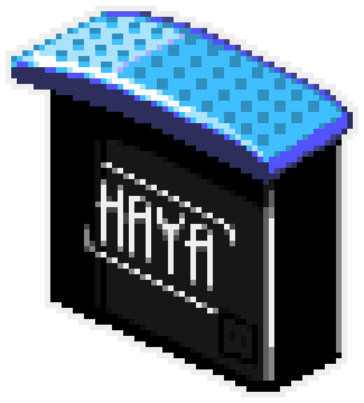

# SRB2Kart: Haya's Expansion Pak

[SRB2Kart](https://srb2.org/mods/) is a kart racing mod based on the 3D Sonic the Hedgehog fangame [Sonic Robo Blast 2](https://srb2.org/), based on a modified version of [Doom Legacy](http://doomlegacy.sourceforge.net/).

This repo hosts my personal expanded fork of [Galactice's Galaxy build](https://mb.srb2.org/addons/srb2kart-galaxy.4500/), to include some new features.

This build requires [snowy_files.kart](https://cdn.discordapp.com/attachments/977366683201187890/1038939545242194050/snowy_files.kart).

## Galaxy Features
- Percentage Speedometer from Lonsfor
- Custom resolutions for OpenGL and Software from Birdhouse
- Replay Marker from Tyron
- Turnsmoothing from Birdhouse
- Dedicated server replays from Birdhouse
- OpenGL-render-distance adjuster setting from Birdhouse
- Birdmod included
- Callmore's Character Skin Selection
- driftsparkpulse from Ashnal

## This fork's features
- James' `local-skins` branch, with some touchups by me.
- Functional visportals in the OpenGL renderer.
  - OGL Visportals from [Hannu Hanhi's incomplete visportal implementation](https://git.do.srb2.org/bird/Kart-Public/-/tree/oglportalsalt) and [its port to SRB2 2.2](https://git.do.srb2.org/Hannu_Hanhi/SRB2/-/tree/hwportals).
- [JadenArcm's Snowy-Kart.](https://github.com/JadenArcm/Snowy-Kart)

**YOU SHOULD NOT USE THIS AS A DEDICATED SERVER. USE VANILLA OR MOE'S MANSION.**

## Dependencies
- NASM (x86 builds only)
- SDL2 (Linux/OS X only)
- SDL2-Mixer (Linux/OS X only)
- libupnp (Linux/OS X only)
- libgme (Linux/OS X only)

## Compiling

See [SRB2 Wiki/Source code compiling](http://wiki.srb2.org/wiki/Source_code_compiling). The compiling process for SRB2Kart is largely identical to SRB2.

## Disclaimer
Kart Krew is in no way affiliated with SEGA or Sonic Team. We do not claim ownership of any of SEGA's intellectual property used in SRB2.
